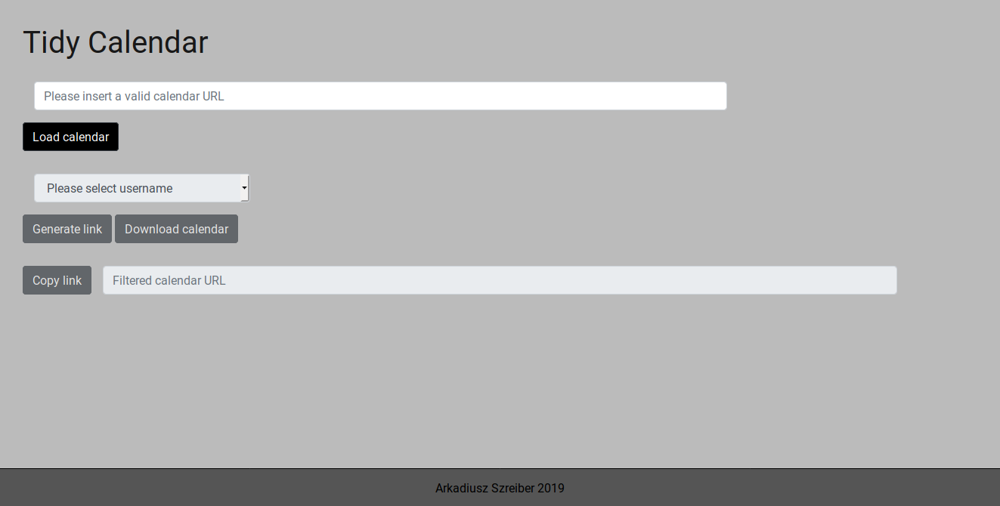

# Tidy Calendar (Codecool Pet Project)

## About project
This application purpose is to get individual calendars from a group calendar.

## Dependencies
- certifi==2018.11.29
- chardet==3.0.4
- Click==7.0
- Flask==1.0.2
- idna==2.8
- itsdangerous==1.1.0
- Jinja2==2.10
- MarkupSafe==1.1.0
- requests==2.21.0
- urllib3==1.24.1
- Werkzeug==0.14.1

## Screenshot

